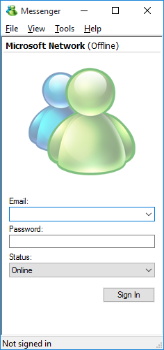

# Messenger
Was supposed to be a windows messenger clone.

Back in the day we were all using WM to communicate and I really didnt like when Microsoft started phasing out Windows Messenger in favor of MSN Messenger (which I thought was bloated) so I started an amibitius project of making my own client UI.

